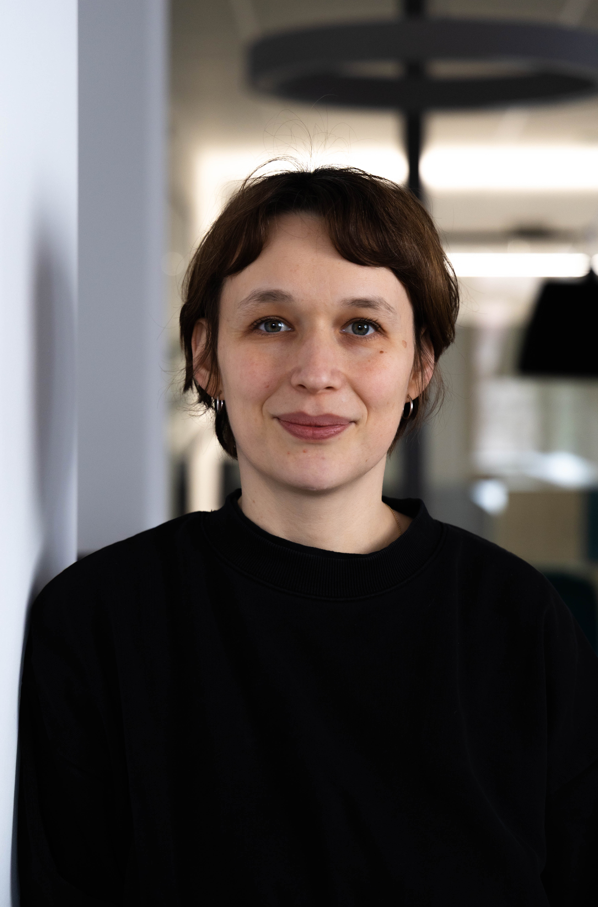

I am currently a postdoctoral researcher within the [Text and Language Lab](https://www.dhss.phil.fau.de/text-and-language-lab/) at the [Department of Digital Humanities and Social Studies](https://www.dhss.phil.fau.de/) at the Friedrich-Alexander-University Erlangen-Nuremberg. I completed my PhD at McGill University in Montreal at the [Department of Languages, Literatures, and Cultures](https://www.mcgill.ca/langlitcultures/) where I was advised by [Andrew Piper](https://andrewpiper.ai/). I have a Master's degree from the University of Vienna in Comparative Literature.

My research uses machine learning to study narrative and culture. I work on questions around fictional worlds and setting, narrative absorption, embodiment, and metaphor across large text collections, combining NLP, text annotation, and quantitative methods. I also approach questions surrounding AI from a humanities perspective, using computational methods to study how these systems work with language and narrative. Alongside this, I build open research infrastructure. I have compiled and published large literary corpora for others to reuse, and developed open, reproducible methods for integrating bibliographic metadata into Wikidata. I am also interested in annotation as a research practice, and in developing tools to support it.

[CV](cv_updated.pdf) / [Email](mailto:katrin.rohrbacher@fau.de) / [Bluesky](https://bsky.app/profile/katrohrbacher.bsky.social)

Photo: Ismail Barakat

## News

- 08/2026 TalkPaper Paper accepted at EMNLP 2026 (Main Conference): "How LLMs Build Fictional Worlds: Measuring Setting and Narrative Space in AI-Generated Creative Storytelling"
- 08/2026 Grant Awarded the FAU Emergent Talents Initiative (ETI) Grant for the project "Nature in Motion: A Computational Study of Environmental Representation in Travel Writing"
- 07/2026 TalkPaper Long paper at DH 2026, South Korea: "Towards the Automatic Detection of Animal Metaphors in Literary Texts"
- 04/2026 Talk COMPTEXT 2026, University of Birmingham: "Modeling Embodiment in Narratives"
- 2026 Paper "Bridging the Gaps: Integrating Bibliographic Metadata Into Wikidata for Literary Corpora", *Journal of Open Humanities Data*
- 01/2026 Talk Invited talk, University of Bielefeld: "Measuring Narrative Space: A Computational Study of German and English Prose Fiction"
- 11/2025 Talk Invited talk, University of Hamburg, DH Lecture Series: "Aspects of Space: Quantitative Evidence and Fictional Worlds"

## Publications

**Rohrbacher, K.**, Nieth, B., Salin, E., Eskofier, B., Mahlberg, M. (2026). How LLMs Build Fictional Worlds: Measuring Setting and Narrative Space in AI-Generated Creative Storytelling. *Proceedings of the 2026 Conference on Empirical Methods in Natural Language Processing (EMNLP)*. To appear.

**Rohrbacher, K.** & Schrittesser, D. (2026). Bridging the Gaps: Integrating Bibliographic Metadata Into Wikidata for Literary Corpora. *Journal of Open Humanities Data*, 12(1), 37. [https://doi.org/10.5334/johd.483](https://doi.org/10.5334/johd.483)

**Rohrbacher, K.**, Wagner, A., Mahlberg, M. (2026). "Letting the Cat out of the Bag": Towards the Automatic Detection of Animal Metaphors in Literary Texts. *Book of Abstracts of the DH 2026*, ADHO Annual Conference, South Korea, pp. 685–688. [https://doi.org/10.5281/zenodo.21495909](https://doi.org/10.5281/zenodo.21495909)

**Rohrbacher, K.** (2026). "Lived Space": A Computational Study of Setting in Fiction. In: B. Herrmann, G. Grisot, R. Aust (eds.), *Comparing Landscapes. Approaches to Space and Affect in Literary Fiction*. Bielefeld University Press. Forthcoming.

Mahlberg, M. & **Rohrbacher, K.** (2026). Corpora in Digital Humanities and Corpus Linguistics. In: H. Nesi & P. Milin (eds.), *International Encyclopedia of Language and Linguistics* (3rd ed.). Elsevier, pp. 62–68. [https://doi.org/10.1016/B978-0-323-95504-1.01548-9](https://doi.org/10.1016/B978-0-323-95504-1.01548-9)

**Rohrbacher, K.** (2025). Opening Worlds: Narrative Beginnings and the Role of Setting. *CCLS2025 Conference Preprints*, 4(1). [https://doi.org/10.26083/tuprints-00030149](https://doi.org/10.26083/tuprints-00030149)

**Rohrbacher, K.** (2025). de-Corp: A Corpus of German Fiction and Non-Fiction (1780–1930). *Journal of Open Humanities Data*, 11(1), 51. [https://doi.org/10.5334/johd.350](https://doi.org/10.5334/johd.350)

Luederitz, C., Animesh, A., **Rohrbacher, K.**, Li, T., Piper, A., Potvin, C., & Etzion, D. (2023). Non-monetary narratives motivate businesses to engage with climate change. *Sustainability Science*, 18(6), 2649–2660. [https://doi.org/10.1007/s11625-023-01386-1](https://doi.org/10.1007/s11625-023-01386-1)

## Teaching

In Summer 2026, I taught two courses at FAU Erlangen-Nuremberg.

**Computing Text and Language (Seminar & Lab, co-taught with Marianna Grachova).** An introduction to digital humanities and the computational analysis of text. The course moves from foundations in linguistic analysis through corpus methods to quantitative techniques such as stylometry, sentiment analysis, topic modeling, and network analysis, with hands-on work in Python. Students learn both how to apply these methods and how to interpret their results critically.

**Critical AI (Seminar).** The seminar approaches AI from a (digital) humanities perspective. Reading literary fiction alongside critical scholarship, the course examines how language-based AI systems work, how they shape interpretation and knowledge production, and the ethical questions they raise. It combines critical and theoretical discussion with some hands-on sessions.

In Winter 2025/26, I taught at FAU Erlangen-Nuremberg:

**Computational Approaches to Storytelling (Seminar).** The seminar offers an introduction to narrative as an object of computational study: how stories work as structures, frames, and strategies for meaning-making. Material ranges from literary fiction to different kinds of online data. The course covers conceptual and computational modeling of narrative, from dataset creation to the interpretation of results.

Previously, at McGill University, I taught seminars on **Modern Short Fiction** (2024) and **The German Novel** (2023). I also taught **German Language** courses at beginner and intermediate levels (2018–2024).

## Advising

I co-advise MA theses on topics in computational humanities.

Current and recent advisees include:

Marius Lin, MA-thesis: "Framing of Political Discourse in Online Forums", FAU Erlangen-Nuremberg, 2025–2026.

Jan-Oliver Reincke, MA-thesis: "Climate Change Narratives in Video Game Storytelling: A Text-Based Computational Study of Emotion", FAU Erlangen-Nuremberg, 2025–2026.
